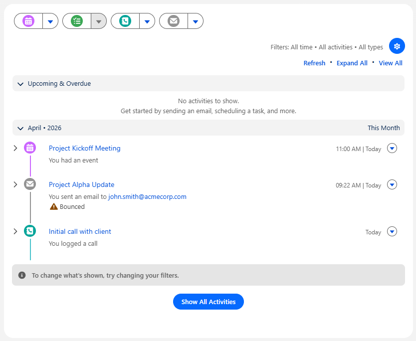
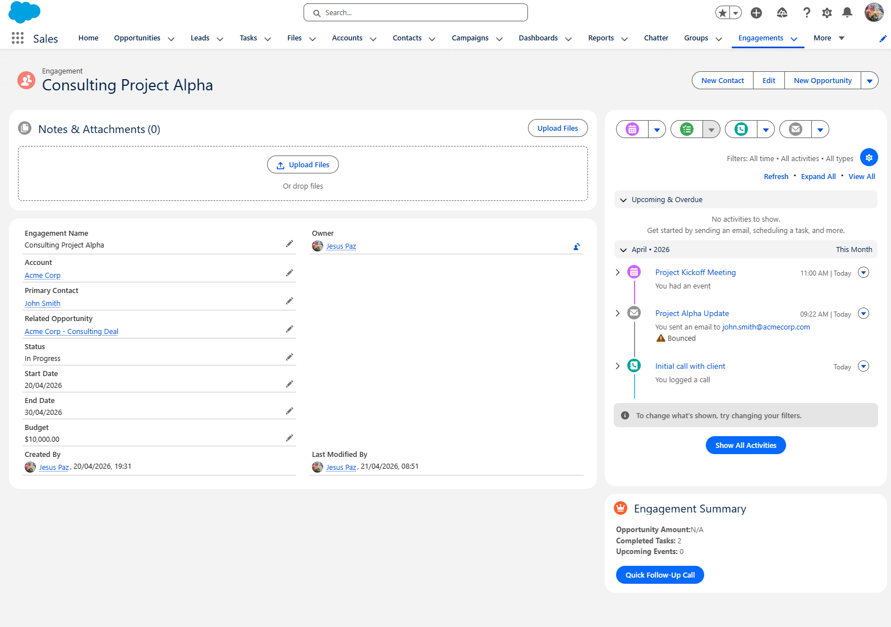
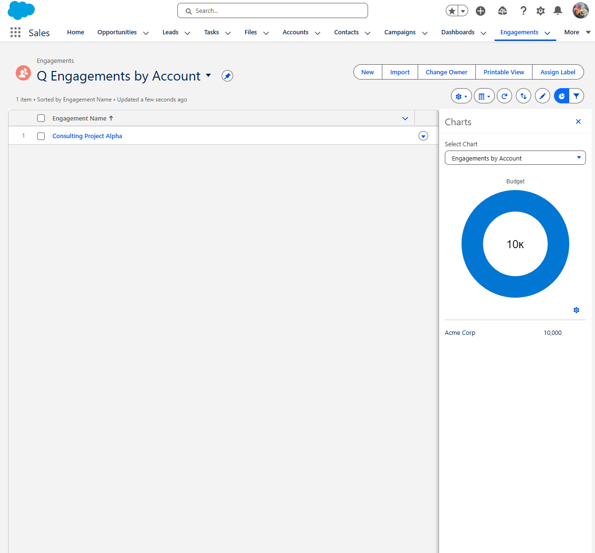
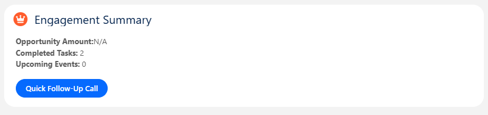
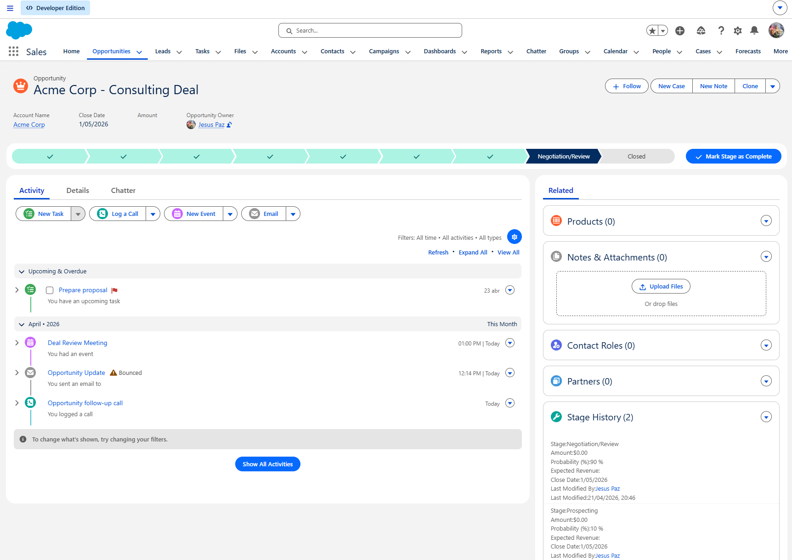
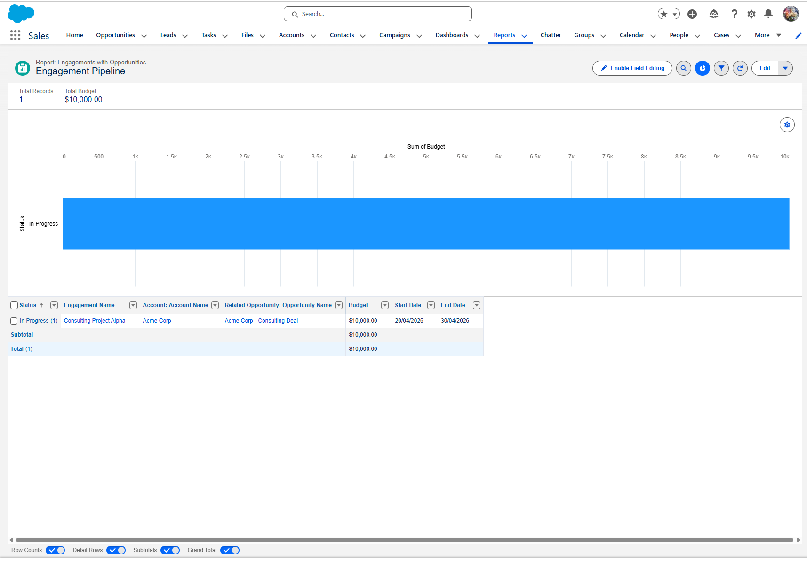

# Prueba Técnica – Salesforce Developer Junior
**Candidato:** Jesus Paz  
**Fecha:** 21 de Abril de 2026  
**Org:** Salesforce Developer Edition

---

## ¿Qué se construyó?

Implementación de un "vertical slice" en Salesforce para Acme Services, permitiendo a los representantes de ventas gestionar Engagements de consultoría y sus actividades relacionadas.

---

## 1. Data Model – Objeto `Engagement__c`

Se creó el objeto personalizado `Engagement__c` con los siguientes campos:

- `Name` (Text) – Nombre del engagement
- `Account__c` (Lookup → Account)
- `Primary_Contact__c` (Lookup → Contact)
- `Related_Opportunity__c` (Lookup → Opportunity)
- `Status__c` (Picklist: Planned, In Progress, On Hold, Completed)
- `Start_Date__c` (Date)
- `End_Date__c` (Date)
- `Budget__c` (Currency)

Se habilitó **Allow Activities** y se agregó el objeto a la app **Sales** mediante un tab personalizado.

---

## 2. Activities (Llamadas, Emails, Eventos)

Se demostraron las tres actividades sobre el registro de Engagement "Consulting Project Alpha":

- [x] **Log a Call** – Task con Type = Call
- [x] **Email** – Enviado desde el registro, visible en el Activity Timeline
- [x] **Event** – Meeting creado sobre el registro

**Screenshots:**

---

## 3. Lightning Record Page + Tab personalizado

Se construyó una Lightning Record Page para `Engagement__c` con:

- **Highlights Panel**
- **Related Lists** (incluyendo Activities)
- **Componente LWC** `engagementSummary`

Activada como página por defecto del objeto. Tab "Engagements" agregado a la app Sales.

**Screenshot:**

---

## 4. List Views

Se crearon dos list views para el objeto Engagement:

| Nombre | Filtro |
|---|---|
| My Open Engagements | Status ≠ Completed, Owner = Yo |
| Q Engagements by Account | Todos los registros |

Se agregó un **List View Chart** (Donut: Sum of Budget agrupado por Account) a la vista "Q Engagements by Account".

**Screenshot:**

---

## 5. LWC + Apex – `engagementSummary`

**Ruta:** `prueba-salesforce/force-app/main/default/lwc/engagementSummary`

El componente muestra sobre el registro de Engagement:

- Monto de la Opportunity relacionada (si existe)
- Conteo de Tasks completadas y Events próximos
- Botón **"Quick Follow-Up Call"** que crea una Task con:
  - Type = Call
  - Due Date = mañana
  - Subject = `"Follow-up on {Engagement Name}"`

**Apex utilizado:** `prueba-salesforce/force-app/main/default/classes/EngagementSummaryController.cls`

- Consulta de Tasks y Events vía SOQL
- Creación de Task via DML

**Screenshot:**

---

## 6. Flow – Automatización

**Flow:** `Opportunity_Stage_to_Negotiation_Flow`  
**Tipo:** Record-Triggered Flow sobre `Opportunity`

**Lógica:**
- Se dispara cuando el Stage cambia a **Negotiation/Review**
- Condición: el campo `Related Engagement` debe estar poblado (se verifica vía lookup inverso)
- Crea una Task sobre el Engagement con:
  - Subject: `"Prepare proposal"`
  - Due Date: hoy + 2 días
  - Priority: High
  - Assigned To: Owner de la Opportunity
- Incluye **fault path** para manejo de errores

**Screenshot:**

---

## 7. Reporte

**Custom Report Type:** `Engagements with Opportunities`  
**Reporte:** `Engagement Pipeline`

Columnas incluidas:
- Engagement Name, Account, Status, Related Opportunity, Budget, Start Date, End Date

Chart: **Bar – Sum of Budget by Status**

**Screenshot:**

---

## Supuestos y decisiones

- El Flow detecta la Opportunity relacionada al Engagement usando el campo `Related_Opportunity__c` en el objeto Engagement; dado que el trigger está en Opportunity, se busca el Engagement relacionado via lookup inverso con `Get Records`.
- El Due Date del Flow se calculó con `TODAY() + 2` (días calendario, no hábiles) ya que Salesforce Flow no tiene función nativa de días hábiles sin Apex.
- El reporte usa Budget en lugar de Opportunity Amount porque el Amount no está disponible directamente en el Custom Report Type sin un objeto B relacionado.

---

## Cómo probar cada ítem

| Ítem | Cómo probarlo |
|---|---|
| Activities (#3) | Abrir "Consulting Project Alpha" → ver Activity Timeline |
| Record Page (#4) | Abrir cualquier Engagement → verificar layout y LWC |
| List Views (#5) | Tab Engagements → cambiar entre vistas → activar chart |
| LWC (#6) | Abrir Engagement → ver datos del LWC → click "Quick Follow-Up Call" → verificar Task creada |
| Flow (#7) | Abrir Opportunity → cambiar Stage a "Negotiation/Review" → guardar → verificar Task "Prepare proposal" en el Engagement |
| Reporte (#8) | Reports → "Engagement Pipeline" → ver tabla y chart |